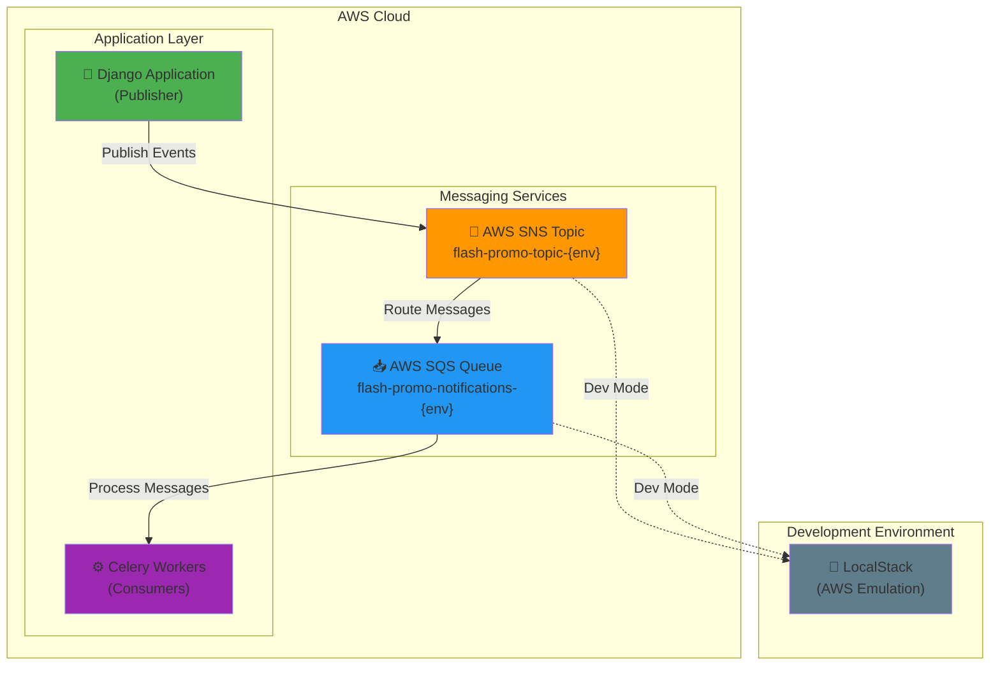
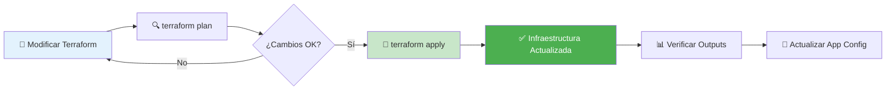

# 🏗️ Documentación de Infraestructura Terraform

> **Gestión de infraestructura como código para Flash Promos Marketplace**

## 📋 Descripción General

Este proyecto utiliza **Terraform** para gestionar la infraestructura de AWS de manera declarativa y reproducible. La infraestructura está diseñada para soportar un sistema de notificaciones escalable utilizando servicios de mensajería de AWS.

## 🏛️ Arquitectura de Infraestructura

### 📊 Diagrama de Servicios AWS



## 📁 Estructura del Proyecto

```
terraform/
├── main.tf              # Configuración principal
├── variables.tf         # Variables de entrada
├── outputs.tf          # Valores de salida
├── providers.tf        # Configuración de providers
├── backend.tf          # Configuración del backend
└── modules/
    └── messaging/      # Módulo de servicios de mensajería
        ├── main.tf
        ├── variables.tf
        └── outputs.tf
```

## 🔧 Componentes de Infraestructura

### 📡 Módulo de Messaging

El módulo `messaging` es el componente principal que gestiona los servicios de comunicación asíncrona:

#### **Recursos Creados:**

1. **📥 SQS Queue**
   - **Propósito**: Cola de mensajes para procesar notificaciones
   - **Naming**: `{queue_name}-{environment}`
   - **Configuración**: Estándar con tags personalizables

2. **📡 SNS Topic**
   - **Propósito**: Tema de publicación para eventos del sistema
   - **Naming**: `{topic_name}-{environment}`
   - **Configuración**: Integrado con SQS para entrega de mensajes

3. **🔗 SNS Topic Subscription**
   - **Propósito**: Conecta el tema SNS con la cola SQS
   - **Protocol**: SQS
   - **Endpoint**: ARN de la cola SQS

### 🌍 Configuración de Entornos

#### **Variables Principales:**

| Variable | Descripción | Valor por Defecto | Tipo |
|----------|-------------|-------------------|------|
| `aws_region` | Región de AWS | `us-east-1` | string |
| `environment` | Nombre del entorno | `dev` | string |
| `use_localstack` | Usar LocalStack para desarrollo | `true` | bool |
| `queue_name` | Nombre base de la cola SQS | `flash-promo-notifications` | string |
| `topic_name` | Nombre base del tema SNS | `flash-promo-topic` | string |

#### **Configuración de Desarrollo:**

- **LocalStack**: Emulación local de servicios AWS
- **Endpoints**: 
  - SQS: `http://localhost:4566`
  - SNS: `http://localhost:4566`
- **Credenciales**: Valores de prueba para desarrollo local

#### **Configuración de Producción:**

- **AWS Real**: Servicios reales de AWS
- **Credenciales**: Variables de entorno o IAM roles
- **Endpoints**: Endpoints oficiales de AWS

## 🚀 Despliegue de Infraestructura

### 📋 Prerrequisitos

- **Terraform**: v1.0+
- **AWS CLI**: Configurado con credenciales apropiadas
- **LocalStack**: Para desarrollo local (opcional)

### ⚡ Comandos de Despliegue

```bash
# Inicializar Terraform
terraform init

# Planificar cambios
terraform plan

# Aplicar infraestructura
terraform apply

# Destruir infraestructura
terraform destroy
```

### 🔧 Configuración por Entorno

#### **Desarrollo Local:**
```bash
# Con LocalStack
terraform apply -var="use_localstack=true"
```

#### **Staging:**
```bash
# Entorno de pruebas
terraform apply -var="environment=staging" -var="use_localstack=false"
```

#### **Producción:**
```bash
# Entorno de producción
terraform apply -var="environment=prod" -var="use_localstack=false"
```

## 📊 Outputs de Infraestructura

La infraestructura expone los siguientes valores para uso de la aplicación:

| Output | Descripción | Uso en Aplicación |
|--------|-------------|-------------------|
| `sqs_queue_url` | URL de la cola SQS | Configuración de Celery |
| `sns_topic_arn` | ARN del tema SNS | Publicación de eventos |
| `sqs_queue_arn` | ARN de la cola SQS | Configuración de permisos |

## 🔐 Consideraciones de Seguridad

### 🛡️ Mejores Prácticas Implementadas

1. **Separación por Entornos**
   - Recursos nombrados con sufijo de entorno
   - Configuraciones específicas por entorno

2. **Gestión de Credenciales**
   - Variables sensibles no hardcodeadas
   - Uso de variables de entorno en producción

3. **Tagging Consistente**
   - Tags obligatorios: Environment, Project
   - Tags personalizables por módulo

### 🔒 Recomendaciones Adicionales

- **IAM Roles**: Usar roles específicos con permisos mínimos
- **Encryption**: Habilitar cifrado en reposo para SQS
- **VPC**: Considerar despliegue en VPC privada
- **Monitoring**: Integrar con CloudWatch para monitoreo

## 🔄 Flujo de Trabajo de Infraestructura

### 📈 Ciclo de Vida



### 🔧 Integración con Aplicación

1. **Terraform Apply** → Genera outputs
2. **Outputs** → Se usan en variables de entorno
3. **Variables de Entorno** → Configuran Django/Celery
4. **Aplicación** → Utiliza servicios AWS

## 📚 Recursos y Referencias

### 🔗 Enlaces Útiles

- **[Terraform AWS Provider](https://registry.terraform.io/providers/hashicorp/aws/latest)**
- **[AWS SNS Documentation](https://docs.aws.amazon.com/sns/)**
- **[AWS SQS Documentation](https://docs.aws.amazon.com/sqs/)**
- **[LocalStack Documentation](https://docs.localstack.cloud/)**

### 📖 Documentación Relacionada

- **[Deployment Guide](DEPLOYMENT.md)** - Guía completa de despliegue
- **[Messaging System](MESSAGING.md)** - Documentación del sistema de mensajería
- **[API Documentation](API.md)** - Documentación de la API

## 🛠️ Troubleshooting

### ❗ Problemas Comunes

#### **Error: LocalStack no responde**
```bash
# Verificar que LocalStack esté ejecutándose
docker ps | grep localstack

# Reiniciar LocalStack si es necesario
docker-compose restart localstack
```

#### **Error: Credenciales AWS inválidas**
```bash
# Verificar configuración AWS
aws configure list

# Para LocalStack, usar credenciales de prueba
export AWS_ACCESS_KEY_ID=test
export AWS_SECRET_ACCESS_KEY=test
```

#### **Error: Recursos ya existen**
```bash
# Importar recursos existentes
terraform import aws_sqs_queue.this queue-name

# O destruir y recrear
terraform destroy
terraform apply
```

### 🔍 Comandos de Diagnóstico

```bash
# Verificar estado de Terraform
terraform show

# Listar recursos
terraform state list

# Verificar configuración
terraform validate

# Ver plan detallado
terraform plan -detailed-exitcode
```

---

<div align="center">
  
  **🏗️ Infraestructura como Código con Terraform**
  
  *Gestión declarativa y reproducible de recursos AWS*
  
</div>